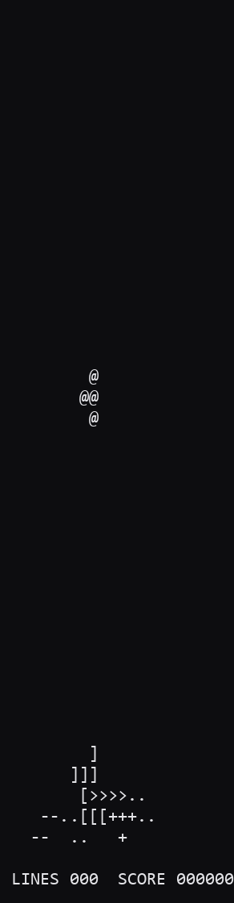

# Tetris in Brainfuck 🧠🟦

A real-time, terminal Tetris whose game logic is a **pure Brainfuck program**
(`tetris.bf`) — generated by a small DSL→Brainfuck compiler and executed by a
bundled host VM. Brainfuck here isn't just the medium; it's the **theme**.

<p align="center">
  
</p>

<p align="center"><em>The 20×40 well is the Brainfuck tape; the active piece is <code>@</code>, and every locked piece draws as its Brainfuck command glyph (<code>&gt; &lt; + - . [ ]</code>) — a real frame straight out of <code>tetris.bf</code>.</em></p>

> **Status:** **playable.** `python build.py && python bf_run.py tetris.bf`
> drops, moves, rotates, locks, clears lines, scores, tops out and shows
> `GAME OVER` — all driven by a pure `tetris.bf`. Built in the open and
> **verified at every step** (**134** tests green; the hard relative‑pointer
> piece engine is proven in real Brainfuck, **23/23**). The closed real‑time
> loop — once the documented "remaining work" — is now implemented and verified;
> the problems that had to be solved to get there are written up honestly in
> [Problems I had to face](#problems-i-had-to-face). This README is the story of
> *how* it was built. *(Still TODO, honestly: hard‑drop/wall‑kick, the
> assembled‑program finale twist, colour, and a size/throughput pass — see
> [What's left](#current-status--whats-left).)*

---

## The twist — "the language is the joke"

This isn't "Tetris that happens to be in Brainfuck." Three ideas fuse:

1. **The well *is* the Brainfuck tape.** The 20×40 = 800‑cell playfield is a
   literal, contiguous region of the program's memory tape. The renderer draws
   straight from those cells — you are watching Brainfuck's memory be the board.

2. **The pieces *are* Brainfuck commands.** Each tetromino is branded with a BF
   command glyph:

   | piece | I | O | T | S | Z | J | L |
   |-------|---|---|---|---|---|---|---|
   | glyph | `>` | `<` | `+` | `-` | `.` | `[` | `]` |

   (`,` is deliberately left out — the assembled program needs no input.)

3. **Cleared lines assemble a runnable Brainfuck program.** As you clear rows,
   their command glyphs are appended to a growing buffer that is kept
   syntactically valid (drop unmatched `]`, auto‑close open `[`). At game over
   the host runs that program in a sandbox and shows its output, then a short
   authored pure‑BF coda prints `GAME OVER` and your score.

**Honest framing:** bracket‑balancing can reorder/drop glyphs, so the finale runs
*a valid Brainfuck program derived from your line clears*, not a literal
transcript. And because the board uses a `+1` bias and `0` sentinels, real‑time
behaviour is host‑coupled (non‑blocking input + ANSI). Both caveats are by design.

---

## Why this is genuinely hard

Brainfuck has no variables, no functions, no types — just a tape, a data pointer,
and eight commands (`> < + - . [ ] ,`). A full Tetris is tens of thousands of
instructions. On top of that, two things make it nasty:

- **Real‑time.** Standard Brainfuck has neither a clock nor non‑blocking input.
- **Runtime addressing.** A falling piece lives at a position that's only known at
  runtime, but Brainfuck has no random access — indexing an 800‑cell array by a
  runtime value the naïve way costs **O(n²)** instructions (≈244k steps at the
  bottom of the well — far over a 33 ms frame budget).

There is no complete, public, real‑time Brainfuck Tetris. The one prior attempt
online is abandoned and contains no source. So most of this project was *figuring
out how it could be done at all* — and proving each piece actually works.

---

## How I approached it

The guiding principle was **evidence before assertions: never claim something
works until real Brainfuck has been executed to prove it.** Everything below
falls out of that.

1. **Design before code.** Brainstormed the concept into a written spec
   (`docs/superpowers/specs/`), choosing the fusion twist, the 20×40 board, a
   terminal host, and a "technical‑feat" success criterion — all before a line of
   implementation.

2. **Research the unknowns, adversarially.** Before committing to the spec, a
   fan‑out of research agents verified the risky assumptions against primary
   sources *and by executing code on this machine*: BF cell/IO semantics, the
   canonical decimal‑print and arithmetic idioms, pure‑Python interpreter speed
   (~2.6M ops/s), Windows non‑blocking input (`msvcrt`) and VT enabling, and
   whether a real‑time BF game is even possible (it is — on a custom host). An
   adversarial critic then pressure‑tested the design and caught the real
   landmines (e.g. that naïve table indexing is O(n²) and disqualified).

3. **Don't hand‑write Brainfuck — *compile* it.** Like the famous large BF
   programs (ELVM compiling a C `vi` clone, etc.), the game is authored in a tiny
   higher‑level DSL and compiled to pure BF. The compiler is a disciplined
   **goto‑emitter**: every variable gets a fixed tape cell, a single cursor is
   tracked at compile time, and `goto(name)` emits the exact `>`/`<` run — pointer
   moves are **never** hand‑counted (that was empirically the #1 source of silent
   bugs).

4. **Prove every idiom against an oracle.** A reference pure‑Python BF VM
   (`src/oracle.py`) is the truth oracle. Every primitive (`copy`, `mul`, `eq`,
   `if`, decimal print, …) is re‑executed and asserted against it. The whole suite
   is **TDD**: write the failing test, implement, watch it pass, commit.

5. **Solve the hard kernel separately, by derivation + execution.** The runtime
   piece engine was the crux. Rather than guess, I ran parallel derive‑and‑prove
   efforts that each had to *execute real Brainfuck and paste the transcript*:
   - absolute indexed read/write (correct but **O(n²)** — disqualified for 800
     cells),
   - **relative‑pointer riding** (the winner), and
   - **compile‑time branch dispatch** for shapes (no runtime table — ~3.5k steps).

   The winning design: the data pointer **rides the well** at the active piece's
   anchor; `px/py/rot` live in "shadow" cells at fixed *relative* offsets from the
   anchor, so collision/movement use only compile‑time‑relative addressing. Each
   frame: `[<]` resync to a left sentinel (absolute phase) → scan‑locate the
   unique anchor marker → relative collision (walls via runtime compares, locked
   cells via relative peeks) → conditional move → lock/spawn. This was proven
   end‑to‑end with a **23/23** test pass and a measured **~37k steps/frame**.

6. **Integrate with discipline, recover honestly.** The verified subsystem was
   ported onto the project compiler and cross‑checked (still 23/23). A genuine
   git‑branch mix‑up mid‑build (work on one branch, working tree on another) was
   untangled and everything consolidated onto a single `main` — documented rather
   than hidden.

The methodology, design rationale, research findings and the implementation plan
all live under [`docs/superpowers/`](docs/superpowers/) — including the
**executed kernel proofs** in
[`docs/superpowers/research/kernel-proofs/`](docs/superpowers/research/kernel-proofs/).

---

## Architecture

Three cleanly separated layers:

```
  src/dsl.py  +  src/game.py  +  src/subsystem.py        build.py
        │  (goto-emitter DSL: variables, macros, the game)   │
        ▼                                                     ▼
                         ───────────  tetris.bf  ───────────
                              (GENERATED, pure Brainfuck)
                                          │
                                          ▼
                                     bf_run.py
            (host VM: optimized interpreter · non-blocking msvcrt input ·
             Windows VT console · ~30fps frame pacing · finale sandbox)
```

- **`src/oracle.py`** — reference pure‑Python BF VM (`run_bf`): 8‑bit wrapping
  cells, `,`→0 on EOF, optional step counter and pointer clamp. The build‑time
  truth oracle.
- **`src/dsl.py`** — the `Compiler` (goto‑emitter, with a relative‑section mode
  for the riding pointer) plus the verified primitive macros.
- **`src/game.py`** — the **memory map** and the BF **ANSI renderer**.
- **`src/subsystem.py`** — the verified relative‑pointer piece engine.
- **`src/driver.py`** — input decoding (key → one‑hot action flags).
- **`src/loop.py`** — the game: the feedback bridge, runtime dispatch, gravity/
  lock/spawn, line clear, scoring, RNG, the main loop and finale.
- **`bf_run.py`** — the runtime host (atomic per‑frame output, console fit).
- **`build.py`** — compiles everything to `tetris.bf` + writes the memory map.

### Memory map (20×40, `+1` biased)

The well is framed by sentinels so the relative machinery is sound — `LEFT_SENT`
is the only `0` to the left of the well, so `[<]` always resyncs the pointer to a
known absolute cell, and every live well cell is `≥ 1`.

```
[ registers · score(BCD) · rng · scratch · ansi/print scratch · asm buffer ]
[ LEFT_SENT=0 ][ well: 800 cells, biased: 1=empty 2..8=locked 9=active 10=anchor ][ RIGHT_SENT=0 ]
```

Shapes are emitted by **compile‑time branch dispatch** (7 pieces × 4 rotations) —
there is no runtime‑indexed shape table.

---

## How it was built — phase by phase

Each phase ends with passing tests and a commit (TDD throughout).

| Phase | What landed | Verification |
|------|-------------|--------------|
| **0 · Plan** | spec, implementation plan, executed kernel proofs | research + adversarial critique |
| **1 · Foundation** | `oracle.py`, `dsl.py` Compiler + primitives (`clear/move/copy/add/sub/mul/eq/neq/gt/if/while/print_dec/switch_cascade/…`) | every primitive re‑proven via the oracle |
| **2 · Host VM** | `bf_run.py`: optimized interpreter (run‑length collapse, bracket‑jump precompute, `[-]` clear‑op), input contract, VT setup, finale sandbox | VM ≡ oracle (differential), sandbox halting/clamp |
| **3 · Render** | 20×40 memory map + ANSI well render (`ESC[H` + 800 biased→glyph cells) | overlap asserts, glyph render asserts |
| **4–5 · Piece engine** | `subsystem.py`: scan‑locate, relative collision, conditional move, lock/spawn, shape dispatch | **23/23** vs the executed reference |
| **6 · Input** | input decoder (key → one‑hot action flags) | one‑hot/preserve asserts |
| **7 · The game** | `loop.py`: the relative→absolute **feedback bridge**, runtime (piece,rot) **dispatch**, gravity + lock + spawn + game‑over, **line clear + shift**, BCD scoring, RNG, the per‑frame **main loop**, init, finale | bridge vs subsystem; dispatch ≡ direct `try_move`; clear vs a Python reference; full headless playthrough |
| **8 · Run & polish** | host frame‑buffering (one atomic write/frame + synchronized output), console fit, flicker/ghost fixes | host tests + on‑screen |

**Total: 134 tests green** (117 + 17 game‑loop regression tests). The `tetris.bf`
artifact is reproducible via `python build.py` (it's gitignored — ~86 MB; a
size/throughput pass is still open).

---

## Current status & what's left

**Done and verified:** the build/oracle/host foundation, the ANSI renderer, the
relative‑pointer **runtime piece engine** — and now the **closed real‑time game
loop** built on top of it. Both R&D problems that gated playability are solved:

1. **Runtime (piece, rotation) dispatch** — guarded branches select the correct
   compile‑time‑specialized engine op for the live `(piece, rot)`; proven byte‑
   for‑byte identical to a direct `emit_try_move` for moves, blocks and rotations.
2. **The relative→absolute feedback bridge** (the linchpin) — instead of trying
   to carry a value out of the riding‑anchor relative frame (the `[<]` resync
   carries none, and a contiguous well has no spare lane), the loop **reconciles**:
   `loop.emit_read_anchor` is an unrolled, compile‑time‑addressed sweep of all 800
   cells that finds the unique anchor and writes its `(x, y)` — compile‑time
   constants — into absolute registers (rot from its shadow). Cheap, and built
   only from already‑verified primitives.

On top of those: gravity + lock + spawn + game‑over, **line clear + shift**
(verified against a Python reference), **BCD scoring**, a small **RNG**, the
per‑frame **main loop**, init and a `GAME OVER`/score finale. Verified by 17 new
loop regression tests **and a full headless playthrough** that drops, locks,
clears and tops out.

**Still left (honestly):**

- **Gameplay:** hard‑drop and pause are decoded but not yet wired; rotation has no
  wall‑kick yet.
- **The (B) twist:** assembling cleared‑line glyphs into a runnable buffer and the
  sandboxed finale that executes it — the renderer already shows twist (A) (locked
  pieces draw as their BF glyphs), but the assembled‑program finale isn't built.
- **Polish:** colour, and a **size/throughput pass** — `tetris.bf` is ~86 MB (far
  pointer runs inflate the source, though the host VM collapses them at runtime)
  and a frame is ~24 fps headless; both are comfortably optimisable.

Per the project's ethos, the loop was **not** declared done until real Brainfuck
had executed it end‑to‑end — see the next section for what that took.

---

## Problems I had to face

Wiring the verified parts into a working game was where the real fights were. In
the spirit of the rest of this README, here are the ones worth remembering —
honestly, including the cases where earlier "verified" work turned out to be only
*partly* verified.

1. **The "verified" piece engine quietly corrupted the playfield — and 117 green
   tests never noticed.** The engine keeps its scratch + the piece's `px/py/rot`
   "shadow" in well cells at a *fixed relative offset* from the riding anchor.
   That offset (~64–79) only lands outside the well when the piece is near the
   *bottom*; for anything higher it falls **inside the 800‑cell playfield**, and
   the cleanup zeroes those cells to `0` (not `EMPTY`). Result: internal zeros
   that break the `[<]` sentinel resync, plus stray `9/10` values masquerading as
   phantom piece markers — a moving piece left a widening trail of corruption
   behind it. The subsystem's 23/23 (and the full 117) only ever asserted *marker
   positions, shadow values and the pointer* — never that the **rest** of the well
   stayed clean, so the flaw sailed straight through. An adversarial audit agent
   independently flagged the same class of bug. Fix: relocate the entire
   scratch/shadow bank past the well so it always lands in dead tape.

2. **…and "past the well" wasn't dead tape — it was my own registers, so the game
   hung forever.** After relocating the bank, a piece spawned at column 8 wrote
   its shadow *exactly* onto `g_t2` — the very cell an `if_then_consume` loop
   tests as its condition — so the loop's `]` saw a non‑zero flag every iteration
   and never exited. The board logic was perfect; the program just never returned.
   Tracking it down meant bisecting a single spawn from "all of it" → "spawn
   only" → "shadow write only" until one three‑cell write reproduced the freeze.
   Root cause: the driver/loop registers were allocated *after* the well, so
   "after the well" overlapped them. Fix: a dedicated `SCRATCH_PAD` region wedged
   between the well and everything allocated later.

3. **A primitive that was only correct by accident — and got slow when fixed.**
   The audit found `switch_cascade` dispatched by **list position, not by key**;
   it passed its tests purely because they used contiguous keys `1,2,3`. The
   renderer relied on that accident. Making it genuinely key‑based was correct —
   and promptly blew the per‑frame render up to ~32M steps, because the general
   path runs an `is_zero` on a *wrapped* subtraction (`work − k` underflows to
   ~250 for every non‑matching candidate → a 250‑iteration loop, ten times per
   cell, 800 cells). The fix was to give the render its own early‑stopping
   decrement cascade that is both correct *and* cheap for contiguous keys.

4. **I spent a while optimising the wrong thing, because two VMs disagree on
   "cost".** The reference oracle counts every single `>`/`<`; the optimized host
   VM collapses a run of them into one op. So the read‑back sweep *looks*
   catastrophic in the oracle (millions of goto‑steps to far registers) yet is
   cheap on the host — while the render's wrapped‑`is_zero` loops are cheap‑looking
   gotos but expensive *real iterations* that don't collapse. Measuring the host
   VM, not the oracle, is what turned a 1.4 fps slideshow into ~24 fps.

5. **Crossing the relative/absolute boundary is genuinely hard — so don't.** The
   contiguous well that makes movement O(1) is exactly what makes it impossible to
   carry a computed value out of the riding‑anchor frame without scribbling over
   the board (the `[<]` resync transports nothing; a carry‑walk corrupts every
   cell it passes; an index‑recovery scan needs a counter that can't travel with
   the pointer). Every attempt to *extract* a bit failed. The working idea was to
   stop extracting and **reconcile** instead: re‑derive the state absolutely from
   the board with compile‑time addresses. Sometimes the move is to not solve the
   problem you framed.

6. **Flicker, and a score that printed four times.** Two separate rendering sins.
   First, the host relayed output **one byte at a time and flushed on every
   newline** — 40+ partial repaints per frame, i.e. tearing; fixed by buffering a
   whole frame and emitting it in a single write wrapped in synchronized‑output
   (`ESC[?2026h/l`). Then the "four scores": the board rows are only 20 columns
   wide, so they never overwrote the columns past 20 where the HUD's trailing
   digits sat, and a stray trailing newline scrolled the whole board up one line
   per frame — so old HUD tails ghosted at several heights. Fixed with `ESC[K`
   (erase‑to‑end‑of‑line) after every row, dropping the trailing newline, and
   forcing the console **buffer == window** (a buffer taller than the window makes
   `ESC[H` home *above* the viewport, which was the real scroll culprit).

The throughline: in Brainfuck, "the tests pass" and "it works" are further apart
than usual. Almost every bug above survived a green suite and only died to an
end‑to‑end execution or an adversarial second look.

---

## Roadmap — ideas & next steps

Concrete, mostly‑scoped follow‑ups, roughly in bang‑for‑buck order:

**Gameplay**
- **Hard drop** — Space is already decoded (`F_HARD` in `driver.py`); wire it to
  repeat the gravity step until the piece locks.
- **Wall kicks** — on a blocked rotation, retry it shifted one cell left, then
  right, before giving up (the spec's "simple kick" — no SRS).
- **Pause** (`P`) and a small **next‑piece preview** (`R_NEXT` is already tracked,
  it just isn't drawn yet).
- **Levels & speed ramp** — shrink `drop_period` every N lines (the `level` and
  `drop_period` cells already exist).
- **Proper 7‑bag RNG** seeded by first‑input timing, replacing the current LCG.

**The (B) twist — the headline feature still to build**
- On each line clear, append the cleared cells' command glyphs to a balance‑
  corrected `asm_buf`; at game over, run that program in the host sandbox
  (`bf_run.run_sandbox`, which already exists) and show its output before the
  score coda. This is what makes *"your line clears compile a Brainfuck program."*

**Polish**
- **Colour** — one ANSI SGR per piece id (7 colours), reset each frame.
- **Tape inspector** panel — a logical‑focus pointer plus a couple of registers.

**Performance & size**
- `tetris.bf` is ~86 MB and a frame is ~24 fps headless. The cost is the
  read‑back/render pointer runs to registers sitting far from the well; moving the
  hot loop scratch adjacent to the well would shrink the source severalfold
  (faster ~10 s startup compile) and push the frame rate toward a steady 30 fps.
- A peephole pass over the emitted BF (run‑collapsing, dead‑scratch elision) would
  help both size and speed.

---

## Repository layout

```
.
├── README.md                     ← you are here
├── docs/superpowers/
│   ├── specs/                    design spec (the "what" and "why")
│   ├── plans/                    the implementation plan
│   └── research/kernel-proofs/   EXECUTED Brainfuck proofs of the hard kernel
└── brainfuck-tetris/
    ├── src/                      oracle, dsl, game, subsystem, driver, loop
    ├── bf_run.py                 host VM / runtime
    ├── build.py                  DSL → tetris.bf
    ├── tests/                    134 tests (oracle, dsl, memory map, render,
    │                              host, subsystem, driver, loop)
    └── README.md                 build/run details
```

---

## Build · Test · Run

Requires **Python ≥ 3.11** (high‑resolution sleep) — developed on 3.12, Windows.

```bash
cd brainfuck-tetris
python -m pytest -q          # run the full suite (134 tests)
python build.py              # generate tetris.bf + tests/memory_map.txt (~86 MB)
python bf_run.py tetris.bf   # play! (first launch spends ~10s compiling the .bf)
```

**Controls:** `A`/`D` move · `W` rotate · `S` soft‑drop · `Q` quit. Run it in a
real console (Windows Terminal / conhost), not an IDE‑embedded one — the host
needs non‑blocking `msvcrt` input and a VT‑capable terminal.

The executed kernel proofs can be re‑run directly to see the engine pass:

```bash
cd docs/superpowers/research/kernel-proofs/runtime-subsystem
python test_bcde.py          # 23/23 PASS
python test_a_scan.py
python test_frame_budget.py  # ~37k steps/frame at 20x40
```

---

## How it was made

Built collaboratively with **Claude Code** (Opus), using a deliberately rigorous
loop: brainstorm → written spec → implementation plan → multi‑agent research and
adversarial review → derive‑and‑prove the hard kernel in real Brainfuck →
test‑driven implementation with frequent commits. The throughline is simple and
non‑negotiable: **if it hasn't been executed and asserted, it isn't done.**
